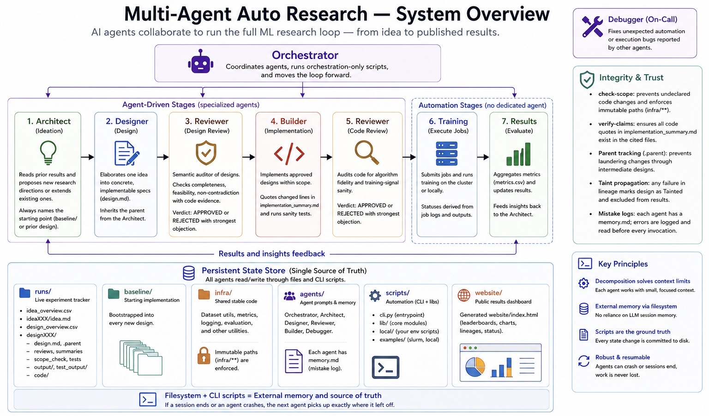

# Multi-Agent Auto Research

Run iterative ML experiments with AI agents handling the entire research loop — from proposing ideas to submitting jobs to publishing results.

You bring a training codebase. The agents handle the rest.

> Beta: this project is still actively updated and improved. If you run into questions, bugs, or confusing behavior, please open a GitHub issue.



---

## Demo

**[AutoSapiens](https://yanghangai.github.io/autosapiens/)** — a live example of this framework applied to human pose estimation research on the [Sapiens](https://github.com/facebookresearch/sapiens) model.

The agents autonomously explored 9 research directions (RGB-D fusion, kinematic attention masking, curriculum loss weighting, layer-wise learning rate decay, depth-aware positional embeddings, ...) across 60+ design variants. The best result reduced validation MPJPE from 142.5 to ~98, a ~30% improvement over baseline.

---

## Why Multi-Agent?

The core motivation is **context window limits**. A single agent running a full research campaign — reading all past results, the entire codebase, the current design, and its implementation — quickly exhausts its context. As the experiment count grows, a single agent becomes unusable.

Splitting the loop into specialized agents keeps each agent's context small and focused: the Architect reads only results summaries, the Designer reads one `idea.md`, the Builder reads one `design.md` plus relevant code. The CSV/file-based state store acts as external memory that persists across sessions. This makes the framework unbounded in campaign length — you can run hundreds of experiments without any single agent's context growing with the experiment count.

A second key feature is the **script layer**. Rather than relying on agents to track state in memory, every meaningful action — registering an idea, syncing statuses, submitting jobs, building the dashboard — is committed to disk through CLI scripts. This makes the system reliable: if an agent crashes or a session ends, no work is lost. The next agent picks up exactly where the last one left off by reading the files.

---

## What It Does

ML research is repetitive: come up with an idea, implement it, run it, check results, repeat. This framework delegates that loop to a team of AI agents that collaborate through a structured workflow:

```
┌─────────────────────── Orchestrator ───────────────────────────┐
│                                                                │
│  Architect → Designer → Reviewer → Builder → Reviewer          │
│      ↑                  (design)              (code)           │
│      │                                           │             │
│      └──────────── results from training ─────── submit jobs ──┘
└────────────────────────────────────────────────────────────────┘
                          Debugger (on-call for automation bugs)
```

Each agent has a focused role:

| Agent | What it does |
|---|---|
| **Architect** | Reads prior results; either proposes a new research direction or extends an existing one. Always names the starting point (`baseline/` or a specific prior design). Grounds proposals in observed performance patterns and a bounded literature search; logs investigations and searches to a shared memory pool so future invocations skip redundant work. |
| **Architect (Explorer mode)** | Same role and output as the Architect, but runs from `agents/Architect/prompt_explorer.md` and is dedicated to producing genuinely unexplored directions — cross-domain transfers, contrarian approaches, techniques not yet present anywhere in `runs/`. Uses an expanded literature-search budget. Spawned on user request or when recent ideas are clustering on the same theme. Shares the same memory pool as the regular Architect. |
| **Designer** | Elaborates one idea into concrete, implementable specs (`design.md`). Inherits the parent from the Architect. |
| **Reviewer** | The *semantic* auditor — everything mechanical is handled by scripts (see Integrity checks below). For designs: spec completeness, idea non-contradiction, implementation feasibility with cited code evidence. For code: algorithm fidelity and training-signal sanity. Every verdict carries a mandatory "strongest objection" field, and every REJECTED writes a structured entry to the offending agent's memory log. |
| **Builder** | Implements approved designs inside scope, quotes changed lines in `implementation_summary.md`, runs sanity tests. |
| **Orchestrator** | Coordinates agents and runs orchestration-only scripts. Intentionally project-agnostic — its prompt carries no project vocabulary, metric names, or file paths; it only dispatches sub-agents (with minimal spawn messages: prompt path + role + identifiers) and runs scripts. All project knowledge lives in the sub-agent prompts that actually do the work. |
| **Debugger** | Fixes unexpected automation or execution bugs reported by other agents |

Experiment state is tracked in plain CSV files under `runs/`. The CLI keeps everything in sync.

---

## Integrity Checks

Scripts do the structural work — agents only make the judgment calls that can't be mechanized.

**`check-scope`** verifies two invariants on every implemented design:

1. Every file that differs from the design's declared parent must appear in `implementation_summary.md`'s `**Files changed:**` list. Silent modifications fail.
2. Every file matching `integrity.immutable_paths` (default `infra/**`) must be byte-identical to baseline — no matter how many designs deep in the lineage.

**`verify-claims`** treats fenced code blocks in `implementation_summary.md` as claims. Each block is attributed to a file (by the last path-like token in the 5 lines above it) and confirmed to appear as a substring of that file's current contents (whitespace-normalized). Outright fabrications are rejected before the Reviewer reads anything.

**Parent tracking (`.parent`)** — `setup-design` records the bootstrap source in `runs/<idea>/<design>/.parent`. You can walk any design's lineage with `python scripts/cli.py lineage <design_dir>`. `setup-design` refuses to bootstrap from a design parent that lacks `scope_check.pass`, so undetected changes cannot be laundered through an intermediate design.

**Taint propagation** — if `scope_check.fail` exists on any ancestor, the design is marked `Tainted`, excluded from `results.csv` aggregation, and flagged in the dashboard. The invariant: the only way to compromise results is to modify `infra/`, and modifying `infra/` is mechanically detectable.

**Project revisions** — when a campaign needs a cross-cutting change (new metric in `infra/`, edited `baseline/`, prompt update, etc.) that the normal idea → design loop can't make, the user invokes the **Reviser** agent. The flow is gated by `python scripts/cli.py begin-revision "<name>"` (refuses if the working tree is dirty or designs are in flight; tags `pre-revNNN` on git HEAD; appends a skeleton entry to `revisions.md`) and `python scripts/cli.py finalize-revision` (validates the entry has a populated `**Scope:**` block and propagates staleness). Designs whose results were produced before a revision whose scope overlaps with their dependencies are flagged `Stale_Since: revNNN` in the design CSV and badged in the dashboard. Stale is distinct from Tainted: results stay in `results.csv`, but the Architect knows from the revision's **Comparability note** what is and isn't directly comparable.

**Mistake log** — each agent's `agents/<agent>/memory.md` is a structured append-only log of past errors. Scripts auto-append an entry to `agents/Builder/memory.md` whenever `check-scope` or `verify-claims` fails; the Reviewer appends entries to the Designer's or Builder's memory on any REJECTED verdict. Agents read their own memory at the start of every invocation.

---

## Getting Started

### 1. Clone the repo

```bash
git clone https://github.com/yanghangAI/MultiAgentAutoResearch.git
cd MultiAgentAutoResearch
```

No dependencies beyond the Python standard library (plus `pytest` to run tests).

### 2. Run the Setup Agent

Open your agent CLI of choice in this repository — **Claude Code**, **Codex**, or any equivalent that can read/write files and run shell commands. Enable the CLI's non-interactive permission mode (e.g. Claude Code's "bypass mode", Codex's auto-approve) so the agent can read and write files without per-action prompts.

Then tell it to act as the Setup Agent:

> Read `setup/Setup_Agent.md` and act as the Setup Agent.

The Setup Agent will take it from there:
- Reads your training code to understand metrics, config, and runtime environment
- Asks you clarifying questions if anything is ambiguous
- Configures `.automation.json` for your project
- Writes and tests `infra/` (shared utilities) and `baseline/` (starting implementation)
- Updates all agent prompts with your project's vocabulary and conventions
- Validates the full pipeline end-to-end before handing off

After setup finishes, close that session and open a new agent-CLI session before starting the Orchestrator.

### 3. Start the research loop

You can run the orchestration loop in two equivalent ways:

- **Python driver (recommended, agent-CLI agnostic):** `python scripts/orchestrator.py` — a state machine that re-snapshots the filesystem each step and spawns sub-agents through whichever CLI is configured in `.automation.json` (`claude-code`, `codex`, or any registered runner). See `docs/python_orchestrator.md` and `docs/agent_runner_contract.md`. *(This driver is in active development on the `python-orchestrator` branch.)*
- **LLM Orchestrator (fallback):** open a new agent-CLI session and tell it to act as the Orchestrator:

> Read `agents/Orchestrator/prompt.md` and act as the Orchestrator.

The Orchestrator spawns the Architect, which reads prior results and proposes ideas. From there the loop runs autonomously — designing, implementing, reviewing, submitting — and surfaces results in the dashboard.

**Have an idea in mind?** You can also call the Architect directly and refine it together before the loop starts:

> Read `agents/Architect/prompt.md` and act as the Architect. I have an idea I'd like to explore: [your idea].

The Architect will assess feasibility, check against prior work, ask clarifying questions, and iterate with you until the idea is precise and ready to design.

**Want a wild, exploratory idea instead?** Call the Explorer-mode Architect to break out of local optima — it favors cross-domain transfers, contrarian approaches, and techniques not yet present in `runs/`:

> Read `agents/Architect/prompt_explorer.md` and act as the Architect (Explorer mode).

It uses an expanded literature-search budget and shares the same memory (Findings + Literature) as the regular Architect, so investigations and searches accumulate across both.

**Need to change the project itself?** After a few experiments you may realize `infra/`, `baseline/`, or an agent prompt needs an update — a new metric, a corrected eval split, a sharper prompt. The normal idea → design loop can't make these changes (they're outside any single design's scope), so call the **Reviser**:

> Read `agents/Reviser/prompt.md` and act as the Reviser. I want to change [what and why].

The Reviser confirms scope with you, runs `begin-revision` (which refuses if a design is mid-training and tags `pre-revNNN` on git HEAD as a recovery point), makes the edits, fills in `revisions.md` with a comparability note, and runs `finalize-revision` to flag any prior design whose results predate the change as `Stale_Since: revNNN`. Stale results stay in `results.csv` and the dashboard, just badged so the Architect knows they're not directly comparable to post-revision designs.

---

## Day-to-Day Usage

Once set up, you interact with the framework at two levels:

**Let agents run the loop** — spawn the Orchestrator when you want new experiments. It coordinates everything.

**Run CLI commands when you need a manual sync:**

```bash
# Register a new idea explicitly
python scripts/cli.py add-idea idea001 "Layer-wise LR Decay"

# Register a new design explicitly
python scripts/cli.py add-design idea001 design001 "Depth-aware positional embeddings"

# Run lightweight structure checks before review
python scripts/cli.py review-check runs/idea001/idea.md

# After training outputs change — update all statuses
python scripts/cli.py sync-status

# When you want to submit all ready designs
python scripts/cli.py submit-implemented

# Rebuild and publish the results dashboard
python scripts/cli.py update-all
```

**Bootstrap a new design manually:**

```bash
# Copy baseline into a new design folder
python scripts/cli.py setup-design baseline/ runs/idea001/design002/
```

**Check results:**

```bash
python scripts/cli.py summarize-results   # aggregates metrics.csv → results.csv (includes `delta_vs_parent`, the design's primary-metric delta vs. the design or baseline it was bootstrapped from)
python scripts/cli.py build-dashboard     # generates website/index.html
```

---

## Configuration

All behavior is controlled by `.automation.json`. The key fields:

```json
{
  "results": {
    "metric_fields": ["train_loss", "val_loss"],
    "primary_metric": "val_loss",
    "metrics_glob": "**/metrics.csv"
  },
  "status": {
    "progress_field": "epoch",
    "done_value": 100
  },
  "submit": {
    "submit_train_command_template": "bash {root}/scripts/local/submit_train.sh {train_script} {job_name}",
    "submit_test_command_template": "bash {root}/scripts/local/submit_test.sh {target_dir} {test_output}",
    "job_count_command": "pgrep -f train.py | wc -l"
  },
  "dashboard": {
    "github_repo_url": "https://github.com/your-org/your-repo"
  },
  "integrity": {
    "immutable_paths": ["infra/**"]
  }
}
```

`integrity.immutable_paths` is a list of globs, relative to a design's `code/` directory, that must remain byte-identical to `baseline/`. Add paths here (e.g. eval loops, split files, metric code) that no design should ever be allowed to change.

The Setup Agent configures these fields for your environment. Reference implementations for Slurm and local runners live in `scripts/examples/`.

The Setup Agent fills this in for you. You only need to touch it if your project's metrics or compute environment changes.

---

## Repository Layout

```
agents/           AI agent prompts and memory
  Orchestrator/
  Architect/
  Designer/
  Reviewer/
  Builder/
  Debugger/
baseline/         Starting implementation — bootstrapped into every new design
infra/            Shared stable code (dataset utils, metrics, logging)
runs/             Live experiment tracker (ideas, designs, statuses)
scripts/
  cli.py          Main CLI entrypoint
  lib/            Core automation modules
  local/          Your environment's submission scripts (created by Setup Agent)
  examples/       Reference submission scripts (slurm/, local/)
setup/            Agent prompts for initial project setup
website/          Generated results dashboard
.automation.json  Project configuration
```

Within `runs/`, every experiment follows an **idea → design** lifecycle:

```
runs/
  idea_overview.csv              ← all ideas and their status
  idea001/
    idea.md                      ← what to explore and why (includes **Suggested Parent:**)
    design_overview.csv          ← all designs under this idea
    design001/
      design.md                  ← concrete implementation spec (includes **Parent:**)
      .parent                    ← absolute path of the bootstrap source (baseline/ or prior design)
      design_review.md           ← Reviewer design decision (APPROVED / REJECTED)
      code_review.md             ← post-implementation code audit
      implementation_summary.md  ← Builder's change log; cites files and quotes key snippets
      scope_check.pass/.fail     ← result of check-scope (declared-scope + immutable invariants)
      test_output/               ← outputs from the reduced test-train run
      output/                    ← outputs from the real training run (project-specific)
      code/                      ← actual implementation (bootstrapped by setup-design)
```

Statuses are derived automatically from filesystem signals — review files, training outputs, job logs. Never edit CSVs by hand; run `sync-status` instead.
If you create a new `runs/ideaXXX/idea.md`, include `**Idea Name:** ...` so `sync-status` can auto-register it in `runs/idea_overview.csv`.
If you create a new `runs/<idea_id>/designXXX/design.md`, include `**Design Description:** ...` so `sync-status` can auto-register it in `runs/<idea_id>/design_overview.csv`.

**Design lifecycle:**

```
Not Implemented → Implement Failed
Not Implemented → Implemented → Submitted → Training → Done
                                         → Training Failed
(any state)     → Tainted  (scope_check.fail on self or any ancestor)
```

**Idea lifecycle** (derived from its designs):

```
Not Designed → Designed → Implemented → Training → Done
```

---

## All CLI Commands

```bash
python scripts/cli.py validate-config                 # check .automation.json static fields
python scripts/cli.py validate-config --search-dir <dir> # also verify metrics glob + columns against real output
python scripts/cli.py add-idea <idea_id> <idea_name> # register a new idea
python scripts/cli.py add-design <idea_id> <design_id> <description> # register a new design
python scripts/cli.py review-check <target> # quick idea/design structure checks
python scripts/cli.py review-check-implementation <design_dir> # structural + check-scope + verify-claims in one step
python scripts/cli.py check-scope <design_dir> # declared-scope + immutable-path integrity diff
python scripts/cli.py verify-claims <design_dir> # verify fenced code blocks in implementation_summary.md appear in the files they cite
python scripts/cli.py lineage <design_dir>     # walk the .parent chain back to baseline
python scripts/cli.py sync-status              # derive and update all statuses
python scripts/cli.py summarize-results        # aggregate metrics into results.csv
python scripts/cli.py setup-design <src> <dst> # bootstrap a new design from a source
python scripts/cli.py submit-test <design_dir> # submit a sanity test job
python scripts/cli.py submit-implemented       # submit all Implemented designs
python scripts/cli.py build-dashboard          # generate website/index.html
python scripts/cli.py deploy-dashboard         # push dashboard to gh-pages
python scripts/cli.py update-all               # sync + build + deploy in one step
python scripts/cli.py begin-revision <name>    # start a logged cross-cutting change (Reviser agent)
python scripts/cli.py finalize-revision        # validate revisions.md entry + propagate staleness
```
